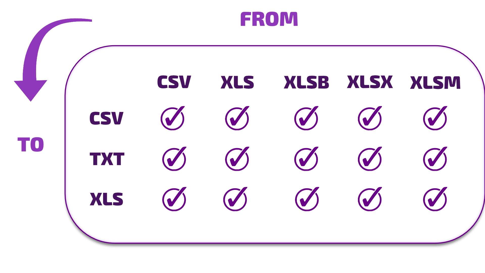

[](https://www.nuget.org/packages/SheetHelper/)
[](Changelog.md)
[](License.txt)

 Veja a documentação em português [clicando aqui](SheetHelper/Globalization/Readme_br.md).<br/>

# SheetHelper
**SheetHelper** is a fast and lightweight library designed for easy reading and conversion of large Excel files. It offers a variety of features that streamline Excel file management, supporting numerous file formats and conversion operations.<br/>

 

## Key Features:<br/>
- ✔ Supports `.xlsx`, `.xlsm`, `.xls`, `.xlsb`, `.csv`, `.txt`, `.rpt`, and other formats.
- ✔ Convert Excel sheets to `DataTable` with `GetDataTable`.
- ✔ Save `DataTable` in multiple formats and apply row/column restrictions with `SaveDataTable`.
- ✔ Terminate all Excel processes (even background ones) using `CloseExcel`.
- ✔ Retrieve column index by name (e.g., `"AB"`) with `GetIndexColumn`.
- ✔ Fetch the column name using `GetNameColumn`.
- ✔ Use `GetRowArray` to extract a row from a `DataTable`.
- ✔ Convert arrays into `DataRow` with `ConvertToDataRow`.
- ✔ Perform file conversions using the `Converter` method.
- ✔ Convert specific row ranges like `"1:23"`, `"-34:56"`, `"70:40"`, `"75"`, `"-1"`.
- ✔ Convert column ranges such as `"A:H"`, `"4:9"`, `"4:-9"`, `"B"`, `"75"`, `"-2"`.
- ✔ Overwrite files during conversion if they already exist.
- ✔ Select specific sheets for conversion by index or name (case-insensitive).
- ✔ Choose the file format for conversion.
- ✔ Specify the destination file name, location, and format.
- ✔ Modify the delimiter for conversion.
- ✔ Convert hidden columns, rows, and sheets.
- ✔ Pick specific columns and rows for conversion.
- ✔ Track conversion progress via the `Progress` property.
- ✔ Displays `MessageBox` for file-not-found errors on .NET Framework.
- ✔ Supports automatic extraction of `.GZ` and `.ZIP` files using `UnGZ`, `UnZIP`, or `UnzipAuto`.


<br/>Uses the library [ExcelDataReader](https://github.com/ExcelDataReader/ExcelDataReader) to perform the reading.<br/>

<br/>

## Contact:
https://bit.ly/FeedbackHappyHelper

<br/><br/>

## Main Conversion Scenarios:<br/>
 


## Installation:
```bash
 dotnet add package SheetHelper
```

<br/>

## Usage Example:
```c#
using SH;

namespace App
{
    static class Program
    {
        static void Main()
        {
            string source  = "C:\\Users\\Diego\\Files\\Report.xlsx.gz";
            string destination = "C:\\Users\\Diego\\Files\\Report.csv";

            string sheet = "1"; // Use "1" for the first sheet (index or name)
            string delimiter = ";";
            string columns = "A, 3, b, -5:-1"; // or null to convert all columns or "A:BC" for a column range
            string rows = "1:2,:4, -2"; // Eg: Extracts from the 1nd to the 4nd row and also the penultimate row      

            var sheetHelper = new SheetHelper();
            bool success = sheetHelper.Converter(source, destination, sheet, delimiter, columns, rows);         

            Console.WriteLine(success ? "The file was converted successfully!" : "Failed to convert the file!")
        }
    }
}

```