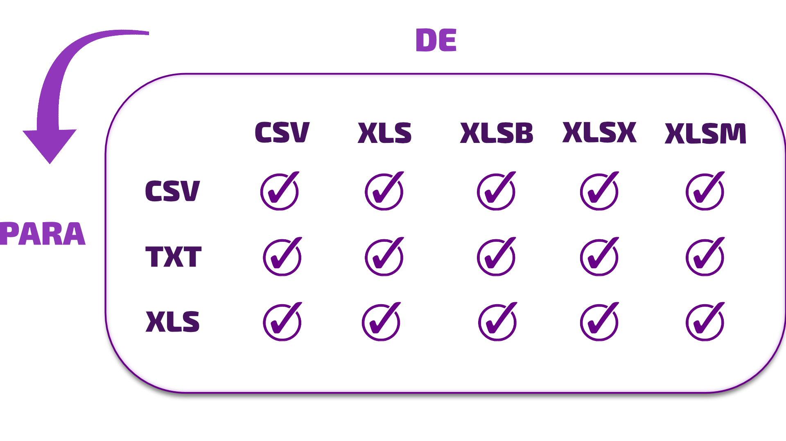

[](https://www.nuget.org/packages/SheetHelper/)
[](Changelog_br.md)
[](../../License.txt)


 See the documentation in English by [clicking here](../../Readme.md).<br/>

# SheetHelper
**SheetHelper** é uma biblioteca rápida e leve para facilitar a leitura e conversão de grandes arquivos Excel. Ela oferece diversos recursos que simplificam a manipulação de arquivos Excel, suportando vários formatos e operações de conversão.<br/>

 

## Recursos disponíveis:
- ✔ Compatível com leitura de arquivos `.xlsx`, `.xlsm`, `.xls`, `.xlsb`, `.csv`, `.txt`, `.rpt` e outros.
- ✔ Obtenha um `DataTable` de uma planilha usando o método `GetDataTable`.
- ✔ Use `SaveDataTable` para salvar um `DataTable` em diferentes formatos, aplicando restrição de colunas e linhas.
- ✔ Encerre todos os processos do Excel (inclusive os em segundo plano) usando o método `CloseExcel`.
- ✔ Recupere o índice da coluna fornecendo o nome (ex.: `"AB"`) com o método `GetIndexColumn`.
- ✔ Obtenha o nome da coluna utilizando o método `GetNameColumn`.
- ✔ Extraia uma linha de um `DataTable` com o método `GetRowArray`.
- ✔ Converta arrays em `DataRow` usando o método `ConvertToDataRow`.
- ✔ Converta planilhas para diferentes formatos com o método `Converter`.
- ✔ Permite converter intervalos de linhas como: `"1:23"`, `"-34:56"`, `"70:40"`, `"75"`, `"-1"`.
- ✔ Converta intervalos de colunas, por exemplo: `"A:H"`, `"4:9"`, `"4:-9"`, `"B"`, `"75"`, `"-2"`.
- ✔ Substitui arquivos durante a conversão, caso já existam.
- ✔ Escolha a aba desejada para conversão, usando índice ou nome (sem diferenciação entre maiúsculas e minúsculas).
- ✔ Selecione o formato de arquivo para conversão.
- ✔ Defina o nome, local de destino e formato do arquivo convertido.
- ✔ Permite alterar o delimitador durante a conversão.
- ✔ Suporta a conversão de colunas, linhas e abas ocultas.
- ✔ Permite selecionar colunas e linhas específicas para conversão.
- ✔ Acompanhe o progresso da conversão por meio da propriedade `Progress`.
- ✔ Apresenta `MessageBox` para erros de arquivo não encontrado no .NET Framework.
- ✔ Suporte para descompactação automática de arquivos `.GZ` (usando `UnGZ`) e `.ZIP` (usando `UnZIP`). Ou utilize `UnzipAuto` para descompactar automaticamente.


<br/>Utiliza a biblioteca [ExcelDataReader](https://github.com/ExcelDataReader/ExcelDataReader) para realizar a leitura.<br/>

<br/>

## Contato:
https://bit.ly/FeedbackHappyHelper


<br/><br/>

## Principais conversões possíveis:<br/>
 


### Instalação:
```bash
 dotnet add package SheetHelper
```

<br/>

## EXEMPLO DE USO:
```c#
using SH;

namespace App
{
    static class Program
    {
        static void Main()
        {
            string origem  = "C:\\Users\\Diego\\Files\\Report.xlsx.gz";
            string destino = "C:\\Users\\Diego\\Files\\Report.csv";

            string aba = "1"; // Use "1" para a primeira aba (possível informar índice ou nome)
            string delimitador  = ";";
            string colunas  = "A, 3, b, 12:-1"; // ou null para converter todas as colunas ou "A:BC" para um intervalo de colunas
            string linhas = ":4, -2"; // Ex: Extrai da 1ª à 4ª linha e também a penúltima linha            

            var sheetHelper = new SheetHelper();
            bool resultado = sheetHelper.Converter(origem, destino, aba, delimitador, colunas, linhas);
            
            Console.WriteLine(resultado ? "O arquivo foi convertido com sucesso!" : "Falha ao converter o arquivo!")
        }
    }
}

```